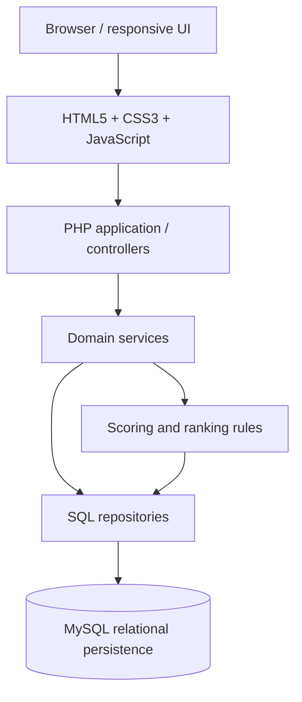
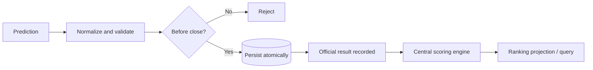

# PickPlay — Engineering Case Study

> A full-stack sports prediction and competition-management platform, presented through its architecture, domain rules, data model, and engineering decisions.


> [!IMPORTANT]
> This repository is a public portfolio case study—not the production source repository. Its schemas, code, and diagrams are self-contained conceptual examples. It contains no production credentials, private data, database dumps, or proprietary implementation.

## What is PickPlay?

PickPlay is a modular web application for running sports-prediction competitions. Participants submit or update score predictions before a match closes; the application evaluates official results with configurable scoring rules and builds general, matchday, team/group, and private-group standings. It also supports scenario simulation without changing official data.

The engineering problem is broader than collecting two scores: the system must enforce time-dependent eligibility, produce deterministic points, rank tied participants consistently, scope data to the correct competition, and preserve an auditable boundary between hypothetical and official results.

## Capabilities

| Area | Responsibilities |
|---|---|
| Participation | Authentication, login, participation confirmation, prediction entry/update, and copy-prediction workflows |
| Competition lifecycle | Competition setup, teams and groups, matchdays, match status, and closing times |
| Results | Consolidated official results and centralized scoring |
| Rankings | General, matchday, team/group, relationship/private-group, current-position, and nearby “threat” views |
| Exploration | Non-destructive result simulation and potential-score analysis |
| Operations | Administration, permissions, session handling, and newsletter/communications support |
| Experience | Responsive HTML/CSS, JavaScript validation, and AJAX-style asynchronous interactions |

These are conceptual modules inside a **modular full-stack application**, not a claim that PickPlay consists of independent microservices.

## Architecture at a glance



The presentation layer captures intent; controllers authenticate, authorize, and coordinate use cases; domain services own scoring, closing-time, simulation, and ranking rules; repositories isolate persistence. This keeps deterministic rules reusable and prevents business logic from being scattered across pages. See [System architecture](docs/02-system-architecture.md) and the [expanded architecture diagram](diagrams/architecture.md).

### Prediction-to-ranking flow



## Technology stack

- **Backend:** PHP application and business-rule services
- **Persistence:** MySQL and SQL with relational constraints, aggregation, and window functions where MySQL 8+ is available
- **Frontend:** semantic HTML5, responsive CSS3, and JavaScript for progressive enhancement and asynchronous requests
- **Engineering workflow:** Git/GitHub, reviewable changes, validation, and AI-augmented development with human ownership

## Core engineering challenges

- **Temporal correctness:** reject writes at or after the authoritative server-side closing instant, including concurrent requests.
- **Rule consistency:** evaluate exact score, goal difference, outcome, draw, and wildcard rules through one deterministic engine.
- **Ranking scope:** aggregate only eligible, finalized matches for the requested competition, matchday, or membership group.
- **Tie semantics:** define whether equal totals share a rank and apply stable display ordering separately.
- **Scenario isolation:** calculate projections from an overlay of hypothetical results without mutating official records.
- **Data integrity:** combine validation and authorization with transactions, constraints, prepared statements, and audit fields.

## Scoring model

The portfolio example uses configurable values, not constants repeated throughout controllers:

| Classification | Base points |
|---|---:|
| Exact score | 5 |
| Correct goal difference | 3 |
| Correct winner | 2 |
| Correct draw | 2 |
| No match | 0 |

Where configured, a group wildcard/special multiplier of **1.5** is applied after classification. Rule precedence matters: exact score is checked before goal difference, followed by draw/winner outcomes. The [scoring design](docs/04-scoring-engine.md) and [PHP example](samples/scoring-engine.php) show a deterministic, testable implementation.

## Ranking and simulation

Rankings accumulate awarded points within an explicit scope. `DENSE_RANK()` can assign the same position to equal point totals while a secondary stable order makes the UI predictable. Matchday and private-group standings reuse the same aggregation with different filters; nearby-player comparisons select a bounded neighborhood around the current participant. Potential points must be labelled separately from awarded points. See [ranking engine](docs/05-ranking-engine.md).

Simulation replaces selected official outcomes only in an in-memory or temporary scenario, reruns the same scoring rules, and recalculates projected positions. It never writes to official match results or awarded scores. See [simulation engine](docs/06-simulation-engine.md).

## Integrity and security posture

Client-side validation improves feedback but is never a trust boundary. Server-side code must normalize and validate inputs, authorize the requested competition and resource, compare closing times using an authoritative clock, use prepared statements, and commit related writes transactionally. Output encoding, CSRF protection, secure sessions, unique constraints, least-privilege database access, secret management, and audit fields form additional layers. This case study separates design recommendations from claims about production. See [Security and data integrity](docs/07-security-and-data-integrity.md) and [security reporting](SECURITY.md).

## AI-augmented engineering

Since 2024, José Escalante has incorporated generative AI into his development workflow for requirement decomposition, alternative designs, code and test drafts, debugging, SQL review, refactoring, UX iteration, and documentation. Generated work remains an input—not an authority. Human review, executable tests, security analysis, source control, reproducible prompts/context, and traceable decisions remain mandatory. No confidential production material should be supplied to external AI systems. The complete workflow is documented in [AI-augmented development](docs/08-ai-augmented-development.md).

## Key technical decisions

- Retain a pragmatic PHP/MySQL foundation and improve boundaries incrementally rather than rewrite for fashion.
- Centralize scoring policy so every workflow produces the same answer.
- Use database aggregation for ranking while keeping scope and tie policy explicit.
- Enforce closing times on the server and recheck them within the write transaction.
- Keep simulation data isolated from official results.
- Treat responsive behavior and progressive enhancement as application requirements.

Decision records and trade-offs are in [Engineering decisions](docs/09-engineering-decisions.md).

## Repository map

```text
docs/         Product, architecture, domain, security, AI workflow, decisions, roadmap
diagrams/     Mermaid views of architecture, data flow, and prediction lifecycle
samples/      Illustrative PHP, SQL, JavaScript, and conceptual schema
screenshots/  Capture plan; no fabricated product imagery
```

Start with the [product overview](docs/01-product-overview.md), then follow the numbered documents. All samples are illustrative and deliberately independent of private production code.

## Future technical improvements

The proposed path begins with scoring tests, stronger constraints, and structured logging; continues with service boundaries, observability, and profiling; and only then adds CI/CD, a containerized development environment, automated quality gates, and an optional API-first evolution. These are roadmap items, not claims of current functionality. See the [technical roadmap](docs/10-roadmap.md).

## Author

**José Vladimir Escalante Rivera**<br>
Computer Engineer / Full-Stack Developer · Peru<br>
GitHub: [@Vladilusion](https://github.com/Vladilusion)

This case study presents software-engineering reasoning while intentionally withholding production implementation and operational details.
