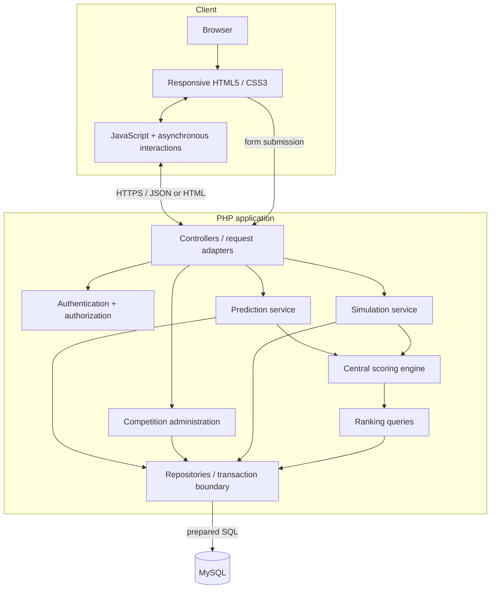

# Layered architecture

This diagram presents logical boundaries inside a modular application; boxes are not independent microservices.

## Boundary notes

- The client gives immediate feedback; the PHP boundary repeats validation and owns authorization.
- Controllers coordinate use cases but do not calculate points.
- The scoring component is deterministic and shared by official and hypothetical calculations.
- Repository methods parameterize values and make transactions explicit.
- MySQL preserves relational constraints and supports scoped ranking aggregation.

See [System architecture](../docs/02-system-architecture.md).
