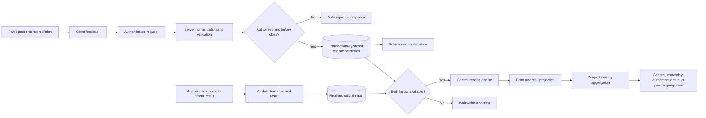

# Prediction-to-ranking data flow

Client validation is advisory. Server validation, authorization, deadline enforcement, and persistence constraints establish the trust boundary. Persisting a prediction confirms only the submission; it does not independently trigger scoring. The scoring engine requires both an eligible stored prediction and a finalized official result. Official result changes should trigger idempotent scoring/recalculation tied to a source or rule version.
