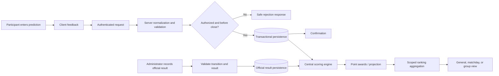

# Prediction-to-ranking data flow

Client validation is advisory. Server validation, authorization, deadline enforcement, and persistence constraints establish the trust boundary. Official result changes should trigger idempotent scoring/recalculation tied to a source or rule version.
