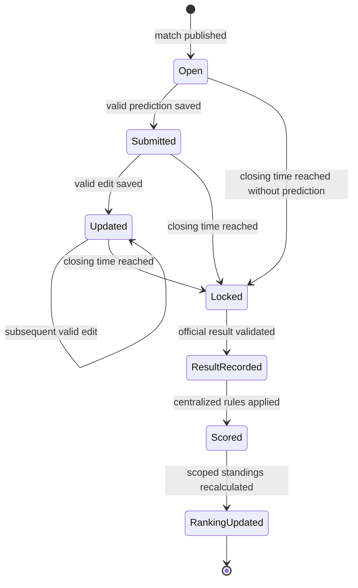

# Prediction lifecycle

The authoritative server rule accepts a write only while `now < closes_at`; equality is locked. Status transitions and times should be checked together so a stale browser cannot reopen a prediction. Administrative corrections require an explicit, audited workflow and idempotent recalculation rather than moving silently backward through this lifecycle.
