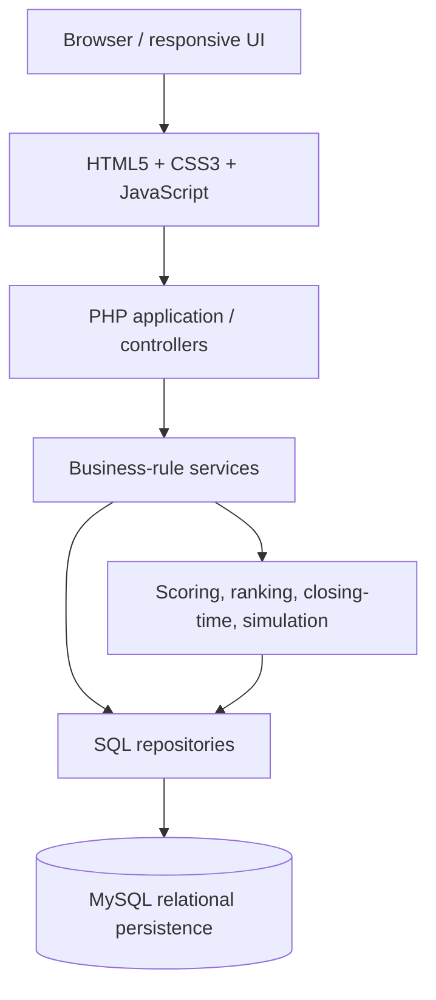

# System architecture

## Architectural style

PickPlay is represented as a pragmatic, layered **modular web application**. Module boundaries improve cohesion and testability without implying independently deployed microservices.

## Layer responsibilities

| Layer | Owns | Must not own |
|---|---|---|
| Presentation | Semantic markup, responsive layout, progressive enhancement, accessible feedback | Authoritative validation or scoring |
| Application/controller | Request parsing, authentication, authorization, use-case coordination, response mapping | Duplicated domain policy or raw SQL spread through pages |
| Business rules | Prediction eligibility, status transitions, rule selection, scenario orchestration | HTTP rendering or credentials |
| Scoring/ranking | Deterministic classification, multipliers, aggregation, tie semantics | Session state or direct user input |
| Persistence | Parameterized SQL, transactions, locking, mappings | UI decisions |

## Request path

For a prediction write, the controller authenticates the session, normalizes the request, and asks an application service to perform the use case. The service authorizes membership, validates scores and match state, rechecks the authoritative closing time in a transaction, and calls a repository to insert or update the participant/match record. A successful response returns the persisted state, not merely the submitted payload.

Read paths may use specialized SQL projections for standings. These remain behind a query boundary so controllers do not encode aggregation policy.

## Module boundaries

- **Identity and participation:** authentication, sessions, permissions, participation confirmation.
- **Competition management:** competitions, teams/groups, matchdays, matches, status, and deadlines.
- **Predictions:** entry, update, copy, normalization, and eligibility.
- **Results and scoring:** official results, rule-version selection, classification, and awards.
- **Rankings:** general and scoped tables, current user, nearby threat, potential scores.
- **Simulation:** scenario overlays and projected standings.
- **Communications:** consent-aware newsletter/notification preparation.
- **Administration:** authorized orchestration over the same domain services.

## Cross-cutting concerns

Use UTC for stored instants and convert only at the presentation edge. Carry a correlation identifier through structured logs. Encode output for its context, keep secrets outside source control, and authorize every server-side resource access. Cache only when invalidation triggers—result updates, scoring changes, or membership changes—are explicit.

## Evolution

This separation allows selective service extraction or an API later, but extraction should follow measured coupling and scaling needs. The current design favors maintainable boundaries within one deployable application. See [engineering decisions](09-engineering-decisions.md).
