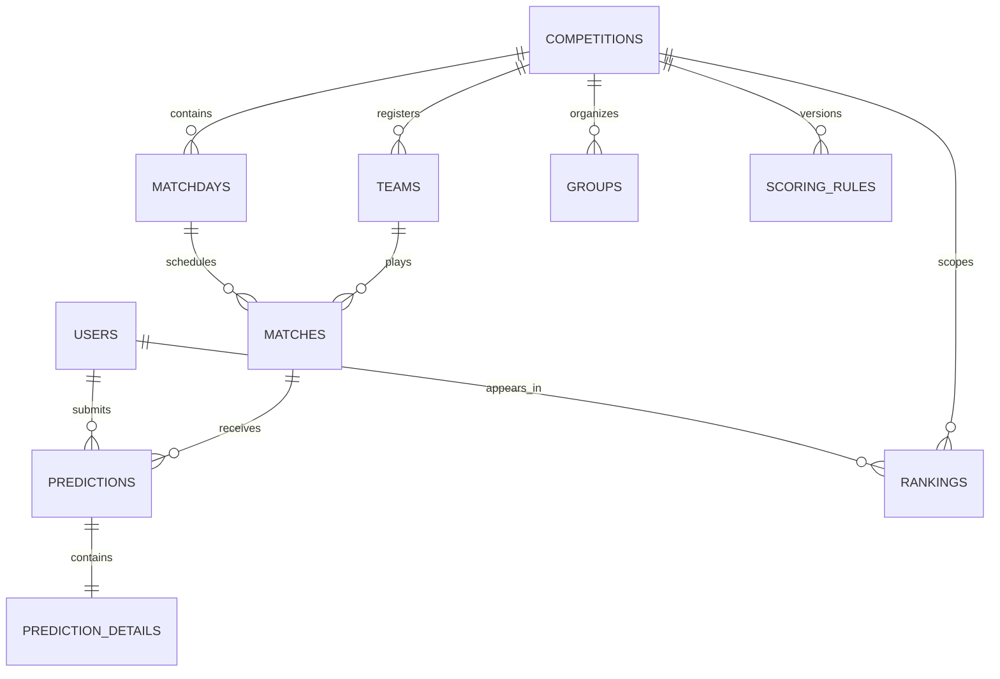

# Conceptual data model

> The entities and names below are a portfolio-oriented conceptualization. They are not asserted to match the production schema.

## Relationship overview

`groups` can represent competition/team groupings; private ranking membership may be modeled with separate `private_groups` and membership junctions in a fuller schema.

## Entity catalog

| Entity | Primary key | Important relationships and fields |
|---|---|---|
| `users` | `id` | unique normalized email; status; password hash; audit timestamps |
| `competitions` | `id` | unique slug; name; timezone/display configuration; lifecycle timestamps |
| `teams` | `id` | FK `competition_id`; unique `(competition_id, code)` |
| `groups` | `id` | FK `competition_id`; unique `(competition_id, name)` |
| `matchdays` | `id` | FK `competition_id`; unique sequence within competition; start/end instants |
| `matches` | `id` | FKs to matchday, home team, away team; kickoff, close, status, official scores |
| `predictions` | `id` | FKs `user_id`, `match_id`; unique pair; submitted/updated timestamps |
| `prediction_details` | `id` | FK `prediction_id`; predicted scores, wildcard choice, awarded values |
| `scoring_rules` | `id` | FK `competition_id`; version and effective interval; point configuration |
| `rankings` | `id` | optional materialized snapshot keyed by scope, user, and calculation version |

Rankings can instead remain a query/read model. If snapshots are stored, they are derived data and need a source version or `calculated_at` timestamp; they must never become the source of truth for predictions or results.

## Keys, constraints, and temporal fields

- Use non-null foreign keys where absence has no domain meaning and restrict deletion of referenced competition history.
- Enforce `home_team_id <> away_team_id`, non-negative scores, and valid status values with application checks plus database `CHECK` constraints where supported.
- Enforce one prediction with `UNIQUE (user_id, match_id)`; use an upsert only after authorization and deadline validation.
- Make team codes and matchday numbers unique **within** a competition, not globally.
- Store `kickoff_at`, `closes_at`, `submitted_at`, `updated_at`, `finalized_at`, and `calculated_at` as UTC instants. Preserve the user-facing timezone in competition configuration.
- Version scoring rules rather than silently editing policy after awards exist. Prevent overlapping effective ranges by transaction/application checks if the database cannot express them directly.
- Audit administrator changes with actor, action, resource, before/after representation or diff, and timestamp, subject to privacy and retention policy.

## Recommended indexes

| Index | Query supported |
|---|---|
| `matches (matchday_id, status, kickoff_at)` | matchday schedule and finalization scans |
| `matches (competition_id, closes_at, status)` | open/closing views (if competition ID is denormalized safely) |
| `predictions (match_id, user_id)` unique | eligibility lookup and duplicate prevention |
| `predictions (user_id, match_id)` | participant history; the unique index may already cover this order |
| `matchdays (competition_id, sequence_no)` unique | ordered competition navigation |
| `scoring_rules (competition_id, effective_from, effective_to)` | effective-rule selection |
| group-membership junction `(group_id, user_id)` unique and reverse `(user_id, group_id)` | scoped rankings and membership checks |

Indexes should be confirmed with realistic query plans and representative, sanitized data; extra indexes increase write and storage cost.

## Integrity workflow

Prediction acceptance should lock or consistently read the match row, compare the database/application authoritative time with `closes_at`, and insert/update in the same transaction. Finalization should validate match status and scores, persist the official result, calculate or enqueue derived awards, and publish ranking changes atomically or through an idempotent, versioned follow-up process.

See the [illustrative schema](../samples/database-schema.sql).
