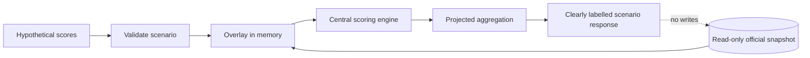

# Simulation engine

## Purpose and boundary

A simulation answers “what if?” by overlaying hypothetical results on unresolved or selected matches, recalculating prediction awards, and projecting positions. It must not update official match results, persisted awards, or official ranking snapshots.

## Scenario algorithm

```text
simulate(competition, authorizedViewer, hypotheticalResults):
    validate viewer access and competition scope
    validate every hypothetical score and referenced match
    officialSnapshot = load predictions, rules, memberships, and official results
    scenarioResults = copy(officialSnapshot.results)
    overlay scenarioResults with hypotheticalResults in memory

    projectedAwards = []
    for prediction in officialSnapshot.predictions:
        result = scenarioResults[prediction.matchId]
        if result is final or hypothetical:
            rule = officialSnapshot.ruleFor(prediction.matchId)
            projectedAwards += score(prediction, result, rule)

    projectedRanking = rank(projectedAwards, requestedScope, tiePolicy)
    return projection with scenario inputs, rule versions, and calculatedAt
```

## Data flow



Reusing the central scoring engine makes simulation comparable to official scoring. A simulation-specific scoring copy would drift as rules evolve.

## Isolation options

- **Request-local model:** simplest; scenarios disappear after the response.
- **Client-owned payload:** server recomputes from submitted scenario data; do not trust client totals.
- **Separate scenario tables:** useful for saved scenarios, with owner, competition, expiration, and explicit foreign keys. They must never share an update path with official results.

Database read transactions or source-version identifiers keep inputs internally consistent while official results are changing. A response should declare the official snapshot version/time so the client can identify stale scenarios.

## Failure and abuse controls

Reject cross-competition match IDs, negative scores, unauthorized private-group scopes, excessive scenario size, and unsupported match states. Bound CPU/database work, rate-limit expensive requests, and avoid logging sensitive payloads. A simulation can be retried safely because it is read-only and deterministic for the same snapshot and inputs.

## Testing

Verify that input ordering does not affect output; official rows remain byte-for-byte unchanged; exact and wildcard rules match official calculations; ties use the documented policy; stale snapshot behavior is explicit; and authorization limits which participant data appears.
